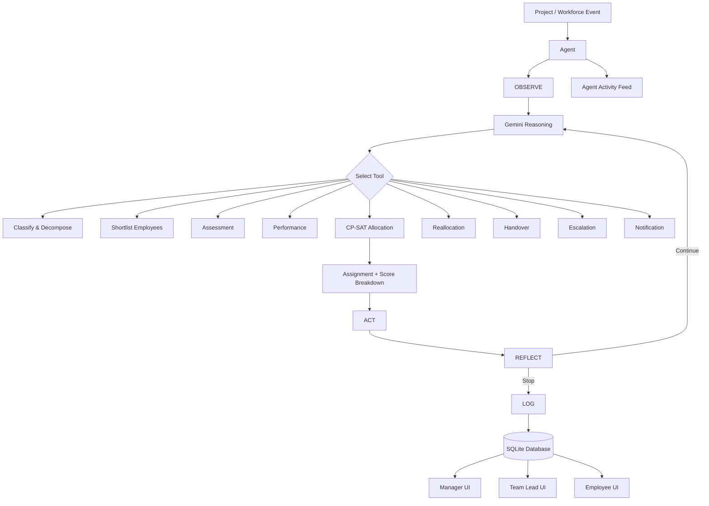

# AI Workforce Allocation Agent

An adaptive AI-powered workforce allocation system that automatically assigns employees to project modules, monitors workload and availability, and dynamically reallocates work when situations change.

The key idea is that allocation is **continuous and event-driven**, rather than a one-time employee-to-task assignment.

---

## 🚀 Project Overview

Companies frequently face changing workforce conditions:

* Employees go on leave or medical absence
* Employees resign
* Project priorities change
* New urgent/P1 projects arrive
* Employees become overloaded
* Tasks become at risk of missing their SLA

The **AI Workforce Allocation Agent** continuously evaluates these changes and determines how work should be reassigned.

### Important Design Rule

> **Gemini never directly chooses employees.**

Gemini acts as the reasoning/orchestration layer and decides **when a tool should be used**.

The actual employee-to-module allocation is performed by **Google OR-Tools CP-SAT**, which enforces the hard allocation constraints.

---

# 🏗️ Architecture



---

# 🛠️ Technology Stack

| Component   | Technology             |
| ----------- | ---------------------- |
| Language    | Python 3.11            |
| Backend     | FastAPI                |
| Database    | SQLite                 |
| ORM         | SQLModel               |
| AI          | Gemini 2.5 Flash       |
| Gemini SDK  | google-genai           |
| Allocation  | Google OR-Tools CP-SAT |
| UI          | Streamlit              |
| Scheduling  | APScheduler            |
| Email       | smtplib + Mock Mailer  |
| Testing     | pytest                 |
| Environment | `.env`                 |

No Docker is required.

---

# 📁 Project Structure

```text
AI_Workforce_Allocation_Agent/
│
├── app/
│   ├── __init__.py
│   ├── main.py
│   │
│   ├── database.py
│   ├── models.py
│   ├── config.py
│   │
│   ├── allocation/
│   │   ├── __init__.py
│   │   ├── cp_sat.py
│   │   ├── constraints.py
│   │   └── scoring.py
│   │
│   ├── services/
│   │   ├── employees.py
│   │   ├── projects.py
│   │   └── performance.py
│   │
│   └── api/
│       └── routes.py
│
├── tests/
│   ├── test_allocation.py
│   ├── test_constraints.py
│   └── test_reallocation.py
│
├── seed.py
├── demo.py
├── requirements.txt
├── .env
├── .env.example
├── README.md
└── workforce.db
```

---

# 🗄️ Database

The system uses a single SQLite database file.

### Core tables

```text
Employee
Skill
EmployeeSkill
Location

Project
Module
Assignment

Assessment
AssessmentResult

DailyUpdate
Approval

LeaveRecord
PerformanceSnapshot

AllocationEvent
ReassignmentRequest
HandoverPacket

Notification
Email
AgentTrace

Config
```

### Main relationships

```text
Employee
   │
   ├── EmployeeSkill ── Skill
   │
   ├── Location
   │
   ├── Assessment ── AssessmentResult
   │
   ├── DailyUpdate
   │
   ├── PerformanceSnapshot
   │
   ├── LeaveRecord
   │
   └── Assignment

Project
   │
   └── Module
          │
          └── Assignment
                 │
                 └── Employee
```

---

# 🎯 Allocation Rules

The CP-SAT allocation engine follows strict hard constraints.

## Hard constraints

### 1. Required skill

An employee must possess the required skill for the module.

### 2. Availability

Employees who are:

* on leave
* medically unavailable
* resigned

cannot receive assignments.

### 3. Workload protection

Employees must maintain a **15% free capacity buffer**.

Therefore:

```text
Maximum usable capacity = 85%
```

### 4. One owner per module

Every allocated module has exactly one owner.

### 5. Dependencies

Dependent modules cannot be scheduled before their required predecessor modules.

### 6. Hardware location

Hardware modules require the employee to be in a workable location.

### 7. Fresher protection

Employees with less than one year of experience initially receive only:

```text
LOW-risk + lower-priority work
```

More difficult work can become available after demonstrating good performance.

---

# 📊 Allocation Scoring

Hard constraints determine **who is eligible**.

Soft objectives determine **which eligible assignment is preferred**.

The scoring considers:

```text
Skill Match
Past Performance
Assessment Score
Urgency / Priority
Workload Balance
Assignment Stability
Location
```

Every assignment stores an explanation.

Example:

```text
Why this person?

Strong Python skill match
+ High assessment score
+ Good historical performance
+ Available capacity

Why not the runner-up?

Runner-up had a lower assessment score
and less available capacity.
```

---

# 🧠 Performance Score

Each employee receives a score from:

```text
0 - 100
```

The score combines:

```text
Assessment/Test Result
Past Project Performance
Daily Consistency
SLA Record
Team Lead Approvals
Experience
```

The weights are configurable through the `Config` table.

Recent performance is given greater importance.

---

# 🔄 Agent Loop

The complete system will eventually operate using this loop:

```text
OBSERVE
   ↓
THINK
   ↓
ACT
   ↓
REFLECT
   ↓
LOG
   ↓
Repeat
```

The maximum number of reasoning steps is:

```text
10
```

Every step is recorded in:

```text
AgentTrace
```

The Streamlit interface will display this as:

```text
Agent Activity Feed
```

---

# 🧰 Agent Tools

The final system will contain these tools:

1. `classify_and_decompose_project`
2. `shortlist_employees`
3. `generate_assessment`
4. `grade_assessment`
5. `compute_performance_score`
6. `run_allocation`
7. `send_assignment_email`
8. `analyze_daily_update`
9. `create_handover_packet`
10. `reallocate_after_event`
11. `escalate`
12. `notify`

---

# ⚡ Dynamic Reallocation

Dynamic reallocation is the main feature of the system.

Supported events include:

```text
Employee Leave
Employee Resignation
Medical Emergency
Priority Change
New P1 Project
SLA Risk
Employee Overload
```

When an event occurs:

```text
Event
  ↓
Find affected modules
  ↓
Leave unaffected assignments unchanged
  ↓
Find eligible replacement employees
  ↓
Run CP-SAT only for affected work
  ↓
Create handover packet
  ↓
Notify stakeholders
  ↓
Record before/after state
```

This prevents unnecessary reshuffling of the entire workforce.

---

# 🧪 Testing

Tests are written using `pytest`.

The system must verify:

```text
✓ Nobody is overloaded
✓ Unavailable employees are never assigned
✓ Freshers only receive allowed work
✓ Dependencies are respected
✓ Only affected modules are reallocated
✓ Different event types work correctly
```

Gemini will be mocked during tests so that tests do not require an actual Gemini API call.

---

# 🌱 Seed Data

Run:

```bash
python seed.py
```

This creates:

```text
30 Employees
Multiple skills
4 Locations
5 Projects
Project modules
Performance history
Availability information
Configuration weights
```

The seed data is designed to provide realistic scenarios for demonstrating the allocation engine.

---

# ⚙️ Installation

## 1. Create the virtual environment

```bash
py -3.11 -m venv .venv
```

## 2. Activate it

### Windows

```bash
.venv\Scripts\activate
```

## 3. Install dependencies

```bash
pip install -r requirements.txt
```

## 4. Configure environment variables

Copy:

```text
.env.example
```

to:

```text
.env
```

Then add the required configuration.

## 5. Seed the database

```bash
python seed.py
```

That's enough to prepare the Phase 1 environment.

---

# 🔐 Environment Variables

Example:

```env
GEMINI_API_KEY=your_gemini_api_key_here

GEMINI_MODEL=gemini-2.5-flash

DATABASE_URL=sqlite:///workforce.db

FREE_CAPACITY_BUFFER=0.15

AGENT_MAX_STEPS=10

MOCK_EMAIL=true
```

The real API key should never be committed to GitHub.

---

# ▶️ Running the Application

Backend:

```bash
uvicorn app.main:app --reload
```

Streamlit:

```bash
streamlit run streamlit_app.py
```

The final project will provide separate views for:

```text
Manager
Team Lead
Employee
Sent Emails
```

---

# 🧪 Running Tests

```bash
pytest
```

Phase-specific tests can also be executed individually:

```bash
pytest tests/test_allocation.py
```

---

# 🎬 Demo

The final demo will demonstrate five scenarios.

### 1. New Software Project

```text
Project created
↓
Modules identified
↓
Eligible employees found
↓
CP-SAT allocation
↓
Assignments generated
↓
Emails sent
```

### 2. Hardware Allocation

The system considers employee location when selecting candidates.

### 3. Medical Leave

```text
Engineer unavailable
↓
Affected module identified
↓
Replacement candidate found
↓
CP-SAT reallocation
↓
Handover packet created
↓
Stakeholders notified
```

### 4. P1 Project

A high-priority project can cause work to be moved.

The system records the impact on the lower-priority project rather than silently changing assignments.

### 5. Nobody Fits

If no employee satisfies the required constraints:

```text
ESCALATE
```

Possible options:

```text
Delay the module
Split the work
Borrow another employee
Hire a contractor
```

Each option includes its trade-offs.

---

# 🏗️ Development Phases

## Phase 1 — Allocation Engine

```text
Database
+
Seed Data
+
CP-SAT Allocation
+
Hard Constraints
+
Soft Scoring
+
Assignment Explanations
```

## Phase 2 — Gemini Tools

```text
Project Decomposition
Assessment Generation
Assessment Grading
Daily Update Analysis
```

## Phase 3 — Agent

```text
Gemini Function Calling
+
Observe
+
Think
+
Act
+
Reflect
+
AgentTrace
```

## Phase 4 — Dynamic Reallocation

```text
Events
+
Affected Module Detection
+
Reallocation
+
Handover
+
Escalation
+
Audit Logging
```

## Phase 5 — User Interface

```text
Manager Dashboard
Team Lead Dashboard
Employee Dashboard
Agent Activity Feed
Event Simulation
Allocation Board
Workload Heatmap
SLA Risk Panel
Sent Emails
Demo
```

---

# 📌 Phase 1 Goal

Phase 1 intentionally does **not** depend on Gemini.

The first milestone is proving that the allocation engine itself works correctly.

The flow is:

```text
Database
   ↓
Employee + Skills + Availability
   ↓
Project + Modules
   ↓
Candidate Filtering
   ↓
CP-SAT
   ↓
Valid Allocation
   ↓
Score Breakdown
   ↓
Assignment Explanation
```

Once this is reliable, Gemini can be added as the reasoning/orchestration layer in Phase 2 and Phase 3.

---

# 🔑 Core Principle

The system separates **reasoning** from **decision enforcement**.

```text
Gemini
"What should I do next?"
        ↓
Tool
"Run allocation"
        ↓
CP-SAT
"These are the mathematically valid assignments."
        ↓
Gemini
"Here is what happened and why."
```

This prevents the LLM from directly inventing employee assignments and keeps the actual allocation constrained, reproducible, and auditable.

---

## Project Status

| Phase                          | Status         |
| ------------------------------ | -------------- |
| Phase 1 — Database + CP-SAT    | 🚧 In Progress |
| Phase 2 — Gemini Tools         | ⏳ Pending      |
| Phase 3 — Agent Loop           | ⏳ Pending      |
| Phase 4 — Dynamic Reallocation | ⏳ Pending      |
| Phase 5 — Streamlit + Demo     | ⏳ Pending      |

---

## License

This project is intended as an academic/hackathon project and can be extended for experimentation with AI-assisted workforce planning.
