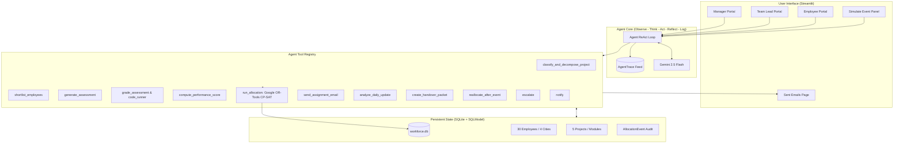

# AI Workforce Allocation Agent

An adaptive, multi-agent AI workforce task allocation and continuous dynamic reallocation engine powered by **FastAPI**, **SQLModel**, **SQLite**, **Google OR-Tools (CP-SAT)**, **Streamlit**, and **Gemini 2.5 Flash**.

---

## Setup in 5 Commands or Fewer

```bash
# 1. Clone & enter repository
git clone <repo-url> && cd workforce-agent

# 2. Configure environment
cp .env.example .env

# 3. Install dependencies
pip install -r requirements.txt

# 4. Seed initial workforce & project database
python seed.py

# 5. Run test suite or launch application
pytest tests/ -v
# streamlit run ui/app.py --server.port=8501
```

---

## System Architecture



---

## Database Tables (20 Models)

1. **Employee**: Core workforce members with roles, experience, city location, availability, and capacity.
2. **Skill**: Technical skills categorized into Software and Hardware.
3. **EmployeeSkill**: Verified proficiency (1-5) linking employee to skills.
4. **Location**: Physical hubs (San Francisco, Austin, New York, Seattle) with hardware lab indicators.
5. **Project**: Software and Hardware projects with P1-P4 priorities and deadlines.
6. **Module**: Discrete tasks with skill requirements, risk levels, complexity, dependencies, and owners.
7. **Assignment**: Active and historical assignments with CP-SAT fit score, score breakdown, and runner-up explanation.
8. **Assessment**: Generated technical test packets (10 MCQs, 1 debug task, 1 code task).
9. **AssessmentResult**: Graded assessments with test scores, code runner output, and accuracy/speed metrics.
10. **DailyUpdate**: Work progress, hours spent, blockers, SLA status, and consistency deltas.
11. **Approval**: Team Lead sign-offs on daily updates.
12. **LeaveRecord**: Active and historical planned leaves, medical emergencies, and resignations.
13. **PerformanceSnapshot**: 0-100 composite scores across tests, past projects, consistency, SLA, and approvals.
14. **AllocationEvent**: Complete audit trail (before, after, reason) for all initial allocations and reallocations.
15. **ReassignmentRequest**: Formal employee task rejection / reassignment requests with mandatory justifications.
16. **HandoverPacket**: Auto-generated transition summaries between old and new module owners.
17. **Notification**: In-app notifications for task owners, leads, and managers.
18. **Email**: Outbound communications with support for both live SMTP and the mock mailer page.
19. **AgentTrace**: Step-by-step logs for OBSERVE, THINK, ACT, REFLECT, LOG live feed.
20. **Config**: Tunable performance weights, CP-SAT objective weights, and buffer ratios.
